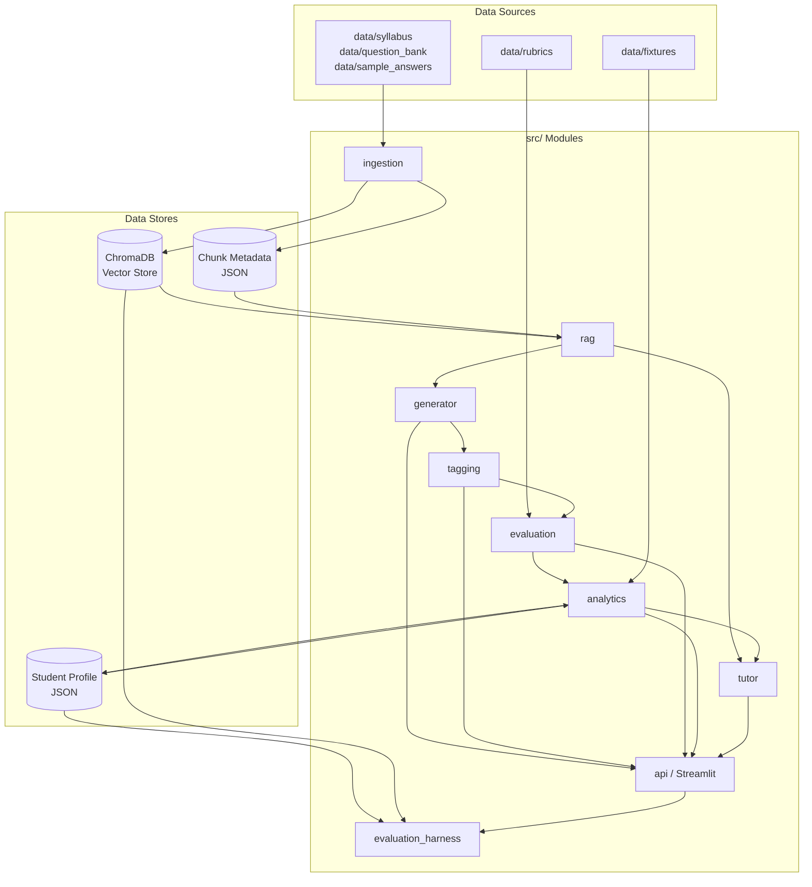
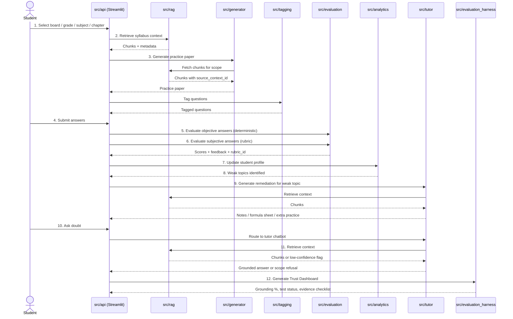
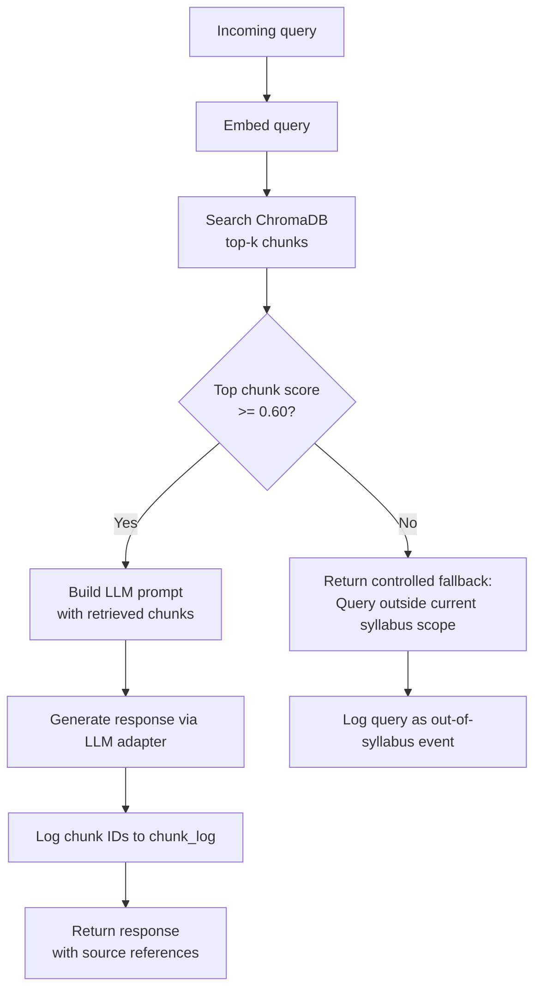
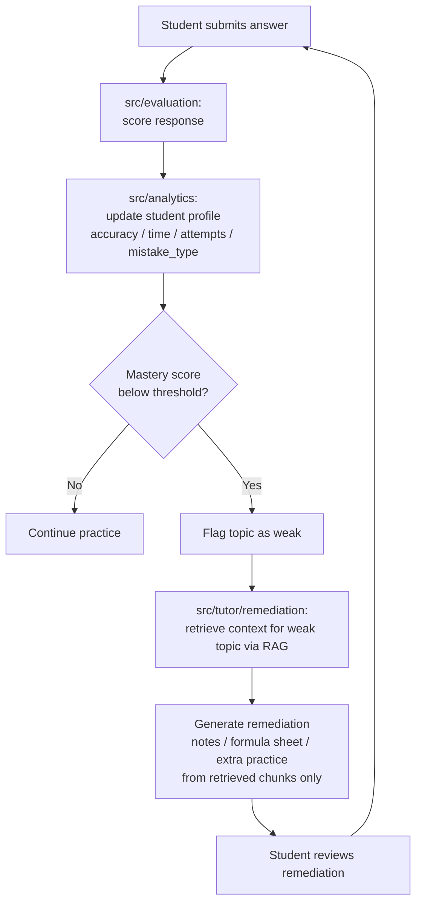

# ARCHITECTURE.md — AI Tutor & Exam Practice System

> **Status:** Phase 2 complete — approved for module spec writing.
> **Author:** Member 1 (Architect)
> **Aligned with:** PROJECT_SPEC.md

---

## 1. Architecture Goals

- RAG-first by default: no module generates syllabus-specific content without retrieval
- One folder, one owner: module boundaries match team assignments exactly
- Mockable LLM interface: all LLM calls go through an adapter so tests run without paid API calls
- Streamlit as the MVP UI: all user-facing flows are wired through a single Streamlit app
- Demonstrably grounded: every module boundary supports Trust Dashboard inspection

---

## 2. Architecture Decisions

| Decision | Choice | Rationale |
|---|---|---|
| MVP UI target | Streamlit-first | Sufficient for demo; avoids REST API complexity in MVP scope |
| `src/tutor/` structure | Unified Tutor & Remediation package | Single owner (Member 8); contains `remediation.py`, `tutor_chat.py`, `guardrails.py`; single spec: `specs/MODULE_SPEC_TUTOR.md` |
| Vector store | Local ChromaDB | No server required; simple local setup for MVP corpus size |
| Vector store fallback | In-memory cosine similarity baseline | Used only if ChromaDB setup fails; reason must be documented in RAG module spec |
| Student profile persistence | File-based JSON | Sufficient for MVP; avoids database setup overhead |
| Rubric storage | JSON files under `data/rubrics/` | Human-authored; version-controlled; loaded by evaluator at runtime |
| `src/api/` role | Integration and orchestration layer for Streamlit | Direct Python function calls to `src/` modules; no HTTP/REST in MVP |
| LLM access boundary | Adapter or mockable interface | All LLM calls isolated behind an interface; tests run without live API calls |

---

## 3. System Components

### 3.1 Component Responsibilities

| Module | Folder | Responsibility |
|---|---|---|
| Ingestion | `src/ingestion/` | Parse source documents from `data/`; chunk text; embed chunks; write chunks and metadata to ChromaDB and metadata store |
| RAG Engine | `src/rag/` | Embed query; search ChromaDB; apply 0.60 cosine similarity threshold; return top-k chunks with metadata; log chunk IDs for every non-trivial response |
| Generator | `src/generator/` | Accept scope inputs (board, grade, subject, chapter, marks, difficulty distribution); call RAG; produce questions with all required fields; assert marks sum matches requested total |
| Tagger | `src/tagging/` | Assign `difficulty`, `skill_tested`, and `question_type` to each generated question; verify `source_context_id` is present |
| Evaluator | `src/evaluation/` | Deterministic MCQ evaluation against human-authored answer keys; rubric-based subjective evaluation using JSON files from `data/rubrics/`; step-wise scoring for at least one worked Mathematics question type |
| Analytics | `src/analytics/` | Maintain student knowledge profile as file-based JSON; compute mastery score using formula defined in module spec; detect weak topics from attempt data; produce weak-area summary derived from stored data only |
| Tutor & Remediation | `src/tutor/` | `tutor_chat.py`: RAG-grounded chatbot with scope enforcement; `remediation.py`: generate notes, formula sheets, and practice from retrieved chunks only; `guardrails.py`: confidence check, out-of-syllabus detection, scope refusal |
| API / Streamlit | `src/api/` | Single Streamlit app wiring the 12-step MVP demo flow; calls `src/` modules directly as Python functions; contains no business logic |
| Evaluation Harness | `src/evaluation_harness/` | Run acceptance criteria checks; verify grounding percentage, marks sum, chunk log coverage; generate Trust Dashboard report as static markdown and optional Streamlit view |

### 3.2 Module-to-Folder Mapping

| Product Module | Folder |
|---|---|
| Syllabus ingestion | `src/ingestion/` |
| RAG-based retrieval | `src/rag/` |
| Practice paper generation | `src/generator/` |
| Question tagging and difficulty classification | `src/tagging/` |
| Automatic answer evaluation | `src/evaluation/` |
| Weakness detection and mastery tracking | `src/analytics/` |
| Personalized remediation and Tutor chatbot (unified) | `src/tutor/` |
| UI and integration layer | `src/api/` |
| Evaluation harness and Trust Dashboard | `src/evaluation_harness/` |

### 3.3 Team Ownership

| Member | Role | Primary Ownership | Module Spec File |
|---|---|---|---|
| Member 1 | Architect & SDD Lead | Project docs, ARCHITECTURE.md, TEAM_TRACKER.md, FINAL_REPORT.md, governance | — |
| Member 2 | Ingestion Engineer | `src/ingestion/` | `specs/MODULE_SPEC_INGESTION.md` |
| Member 3 | RAG Engineer | `src/rag/` | `specs/MODULE_SPEC_RAG.md` |
| Member 4 | Generator Engineer | `src/generator/` | `specs/MODULE_SPEC_GENERATOR.md` |
| Member 5 | Tagging Engineer | `src/tagging/` | `specs/MODULE_SPEC_TAGGING.md` |
| Member 6 | Evaluation Engineer | `src/evaluation/` | `specs/MODULE_SPEC_EVALUATION.md` |
| Member 7 | Analytics Engineer | `src/analytics/` | `specs/MODULE_SPEC_ANALYTICS.md` |
| Member 8 | Tutor & Remediation Engineer | `src/tutor/` | `specs/MODULE_SPEC_TUTOR.md` |
| Member 9 | Streamlit & Integration Engineer | `src/api/` | `specs/MODULE_SPEC_API.md` |
| Member 10 | Evaluation Harness & Dashboard Engineer | `src/evaluation_harness/` | `specs/MODULE_SPEC_EVAL_HARNESS.md` |

---

## 4. Data Stores

| Store | Type | Location | Owner |
|---|---|---|---|
| Vector store | ChromaDB (local) | `data/vectorstore/` (generated, gitignored) | Member 3 (RAG) |
| Chunk metadata | JSON | `data/metadata/` (generated, gitignored) | Member 2 (Ingestion) |
| Source documents | Files | `data/syllabus/`, `data/question_bank/`, `data/sample_answers/` | Member 2 |
| Source registry | Markdown | `data/sources.md` | Member 2 |
| Rubrics and marking schemes | JSON | `data/rubrics/` | Member 6 (Evaluation) |
| Student knowledge profile | JSON | `data/profiles/` (generated, gitignored) | Member 7 (Analytics) |
| Simulated attempt fixture | JSON | `data/fixtures/simulated_attempts.json` | Member 7 |

---

## 5. Data Flow

### 5.1 Ingestion Flow

```
data/syllabus/ + data/question_bank/ + data/sample_answers/
  → src/ingestion: parse, chunk, embed
  → ChromaDB (vectors) + data/metadata/ (chunk metadata JSON)
```

All ingested sources must be listed in `data/sources.md` with review status before ingestion runs.

### 5.2 MVP Demo Flow

The 12-step flow defined in PROJECT_SPEC.md §13:

1. Student selects board, grade, subject, chapter
2. `src/api/` calls `src/rag/` to retrieve syllabus context
3. `src/api/` calls `src/generator/` to produce practice paper; generator calls RAG internally
4. `src/api/` calls `src/tagging/` to tag generated questions
5. Student submits answers
6. `src/api/` calls `src/evaluation/` for objective (deterministic) and subjective (rubric-based) scoring
7. `src/api/` calls `src/analytics/` to update student profile
8. `src/analytics/` identifies weak topics from updated profile
9. `src/api/` calls `src/tutor/remediation` to generate topic-specific notes from retrieved chunks
10. Student asks a doubt
11. `src/api/` calls `src/tutor/tutor_chat` → calls `src/rag/` → grounded answer or scope refusal
12. `src/evaluation_harness/` generates Trust Dashboard report

### 5.3 RAG Grounding Flow

See Diagram 3 below. Key rules:

- Every query is embedded and searched against ChromaDB
- Top chunk score below 0.60 → controlled fallback, no LLM generation
- Top chunk score at or above 0.60 → LLM prompt constructed with retrieved chunks only
- Chunk IDs must be logged for every non-trivial response
- A response with no logged chunk IDs fails the grounding check in the evaluation harness

### 5.4 Attempt → Weakness → Remediation Loop

See Diagram 4 below. Weak-area summaries must be derived from stored `accuracy`, `time_taken`, `attempts`, and `mistake_type` fields — not from open-ended LLM generation.

---

## 6. Diagrams

### 6.1 System Component Diagram



### 6.2 MVP Demo Sequence Diagram



### 6.3 RAG Grounding Flowchart



### 6.4 Attempt → Weakness → Remediation Loop



---

## 7. Interface Contracts

`src/api/` calls all modules as direct Python function imports. There is no HTTP layer in the MVP.

Each module must expose a stable public interface (function signatures) defined in its module spec. The Streamlit owner (Member 9) depends on these interfaces to wire the demo flow without owning business logic.

The LLM adapter boundary applies to all modules that call an LLM. No module may call an LLM provider SDK directly without going through the adapter. This allows the evaluation harness and tests to swap in a mock response without live API credentials.

The rubric loader used by `src/evaluation/` must accept a `rubric_id` and return the corresponding JSON from `data/rubrics/`. This interface must be defined in `specs/MODULE_SPEC_EVALUATION.md`.

---

## 8. Open Risks

| Risk | Status | Resolution |
|---|---|---|
| LLM provider not chosen | Open | Must be decided before `specs/MODULE_SPEC_RAG.md` and `specs/MODULE_SPEC_TUTOR.md` are written; choice affects adapter design and latency target |
| ChromaDB setup fails on a member's machine | Mitigated | Fallback to in-memory cosine similarity baseline; document reason in RAG module spec |
| Simulated attempt fixture schema not agreed | Open | Member 7 (Analytics) must define the JSON schema in `specs/MODULE_SPEC_ANALYTICS.md`; Member 10 (Eval Harness) depends on it |
| Chatbot response latency target not final | Open | To be finalized in `specs/MODULE_SPEC_TUTOR.md` based on chosen LLM and API setup; PROJECT_SPEC.md §13 permits this deferral |
| `data/rubrics/` format not yet defined | Open | Member 6 (Evaluation) must define rubric JSON schema in module spec before any evaluation implementation begins |
